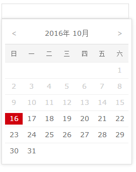
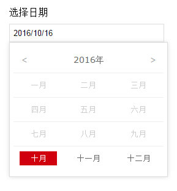

# vue-datepicker-simple

一款非常简单的vue日期选择组件


## Update Log （更新日志

### @1.5.0
- 添加了"时至今日"功能（只能选今天之前）
- 添加了"今天不行"功能（不能选今天）

### @1.4.0
- 兼容vue@2.0+（需要引入对应的组件，绑定value语法有不同，参考示例2）

### @1.3.0
- 添加了"placeholder"属性

### @1.2.0
- 添加了"向前看"功能（只能选今天及以后）

### @1.1.0
- 添加了年份选择功能
- 可以自定义日期格式


## Demo （示例
vue@1.0+ [Click me 点我](http://dai-siki.github.io/vue-datepicker-simple/example/demo.html).

vue@2.0+ [Click me 点我](http://dai-siki.github.io/vue-datepicker-simple/example2/demo.html).


## Screenshot （截图



## Browser Compatibility （浏览器兼容
IE9+

## Env （配置环境
vue + webpack + es6


## Install （安装

#### npm

```shell
$ npm install vue-datepicker-simple
```

## Usage （使用

#### Props （相关参数
| 名称              | 类型               | 默认             | 说明                                         |
| ----------------- | ----------------- | ---------------- | --------------------------------------------- |
| value             | String         | today            | 要绑定的日期变量,值为空则日期面板初始化今天    |
| field             | String            | ""               | 会给input标签添加name及id                   |
| format            | String            | 'yyyy-mm-dd'     | 日期格式                                    |
| forward           | Boolean           | false            | 向前看（只能选择今天及以后）              |
| backward           | Boolean           | false            | 时至今日（只能选择今天之前）              |
| noToday           | Boolean           | false            | 今天不行（不能选今天）              |
| placeholder       | String            | ""               | 你懂的                                     |


#### Example （示例 vue@1.0+
```html
<div id="app">
	<label for="myDate">选择您的新婚之日</label>
	<date-picker field="myDate"
				 placeholder="选择日期"
				 :value.sync="date"
				 format="yyyy/mm/dd"
				 :backward="false"
				 :no-today="true"
				 :forward="true"></date-picker>
</div>

<script>
import 'babel-polyfill'; //因为使用了es6的一些方法，需要babel垫片，如果你项目中已有相关兼容性方案，可忽略
import Vue from 'vue';
import myDatepicker from 'vue-datepicker-simple';

new Vue({
    el: '#app',
    data:{
        date: ''
    },
    components:{
        'date-picker': myDatepicker
    }
});

</script>
```

#### Example （示例 vue@2.0+
```html
<div id="app">
	<label for="myDate">选择您的新婚之日</label>
	<date-picker field="myDate"
				 placeholder="选择日期"
				 v-model="date"
				 format="yyyy/mm/dd"
				 :backward="false"
				 :no-today="true"
				 :forward="true"></date-picker>
</div>

<script>
import 'babel-polyfill'; //因为使用了es6的一些方法，需要babel垫片，如果你项目中已有相关兼容性方案，可忽略
import Vue from 'vue';
import myDatepicker from 'vue-datepicker-simple/datepicker-2.vue'; //引入对应的组件

new Vue({
    el: '#app',
    data:{
        date: ''
    },
    components:{
        'date-picker': myDatepicker
    }
});
</script>
```
