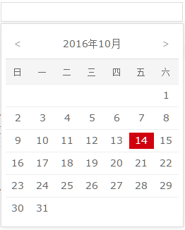

# vue-datepicker-simple
一款非常简单的基于vue的日期选择器

## demo
简单的示例 [点我](http://dai-siki.github.io/vue-datepicker-simple/example/demo.html).

## 截图


## 版本依赖
基于 vue.js@1 版本。模块使用了es7编写，及scss编译

## 安装
### npm
```shell
$ npm install vue-datepicker-simple
```

## 使用

使用方法非常简单，当然用处也很局限。因为只实现了日期选择，源码很单纯，你大可以自己深入源码修改样式和方法。

```html
<div id="app">
    <label for="myDate">选择日期</label>
    <date-picker :value.sync="date" field="myDate"></date-picker>
<div>

<script>
import Vue from 'vue'
import myDatepicker from 'vue-datepicker-simple'

new Vue({
    el: '#app',
    data:{
        date: ''
    },
    components:{
        'date-picker': myDatepicker
    }
});
</script>
```
